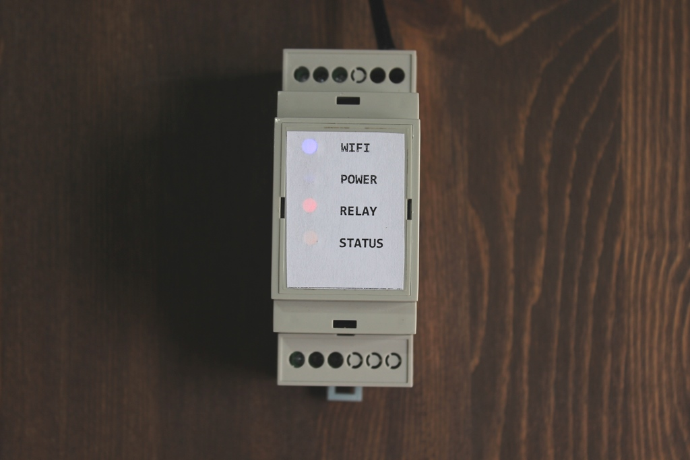

# WIFI_Thermo_Relay #
Thermo relay with wi-fi interface based on ESP-12 module.

## Характеристики ##
* Управление нагрузкой 220В, с максимальной мощностью 1500 Вт
* Возможность установки термопрофиля - включение и выключение нагрузки по температуре
* Нагрузка включается, если температура ниже или равна нижней границе
* Нагрузка выключается при достижении верхней границы температуры
***

***
* При равенстве температуры верхней и нижней границы - режим поддержания термопрофиля выключается
* Возможность включения и выключения нагрузки вручную
* Опрос датчика температуры происходит 1 раз в 10 секунд
* Индикатор "Status" миганием сигнализирует о штатной работе устройства
***

***
* Управление устройством из любого веб-браузера
* Датчик температуры - DS18B20, длина кабеля до 20 метров
* Размеры корпуса на DIN рейку - 2U
* SSID - ThermoRelay_sn
* Пароль - 1234567890

## WI-FI Настройки ##
Перед началом настройки на вашем роутере должен быть включен DCHP!

При первом включении необходимо подключить контроллер к вашей сети WI-FI. Для этого необходимо выполнить поиск доступных сетей на смартфоне либо компьютере. Контроллер создает сеть "ThermoRelay_sn__" пароль "1234567890".

После подключения сети необходимо перейти в веб-браузере по адресу "http://192.168.4.1/wifi" . Откроется окно с настройками wifi. Необходимо ввести имя и пароль вашей сети и нажать кнопку  "Connect/Disconnect"

После этого по адресу "http://192.168.4.1/wifi" можно увидеть IP адрес устройства в вашей WI-FI сети. 
Теперь, когда контроллер подключен к вашей сети, можно отключиться от сети "ThermoRelay_sn". 
При успешном подключении к вашей wi-fi сети должен загореться светодиод “WIFI”. Далее для доступа к веб серверу контроллера используйте IP адрес, выданный вашим  wifi роутером.

## Shema ##

