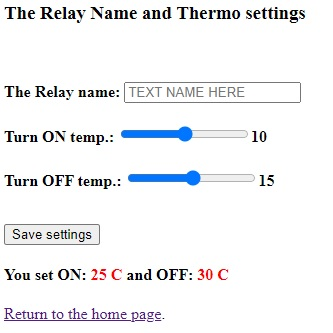
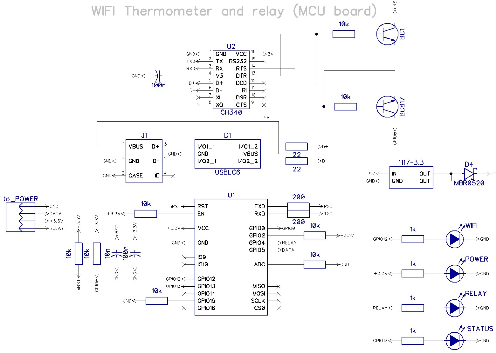

# WIFI_Thermo_Relay #
Thermo relay with wi-fi interface based on ESP-12 module.

## Description ##
* Load control 220 VAC, with a maximum power of 1500W
* Possibility to set a thermal profile - switching the load on and off by temperature
* The load is switched on if the temperature is less than or equal to the lower limit
* The load is switched off when the upper temperature limit is reached
***

***
* When the upper and lower limit temperatures are equal - the thermal profile maintenance mode is switched off
* Possibility to switch the load on and off manually
* The temperature sensor is polled once every 10 seconds
* LED "Status" blinks to indicate normal operation of the device
***

***
* Control the device by any web-browser
* Sensor - DS18B20, cable length up to 20 meters
* DIN rail enclosure dimensions - 2U
* SSID - **ThermoRelay_sn**
* Пароль - **1234567890**

## WI-FI Настройки ##
DCHP must be enabled on your router before starting the configuration!

When you first turn it on, you need to connect the device to your WI-FI network. To do this, search for available networks on your smartphone or computer. The device creates a network "ThermoRelay_sn__" password "1234567890".

After connecting the network, you should go to the address "http://192.168.4.1/wifi" in your web browser. A window with Wi-Fi settings will open. It is necessary to enter the name and password of your network and click the button "Connect/Disconnect"

After that you can see the IP address of the device in your WI-FI network at the address "http://192.168.4.1/wifi". 
Now that the controller is connected to your network, you can disconnect from the "ThermoRelay_sn" network. 
When successfully connected to your Wi-Fi network, the "WIFI" LED should light up. Then use the IP address given by your Wi-Fi router to access the controller's web server.

## Shema ##

